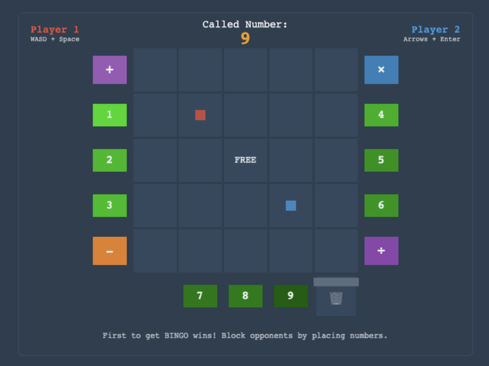

# Over-Bingo

**A chaotic fusion of bingo, math, and frantic multiplayer action.**

Inspired by the cooperative chaos of _Overcooked_, Over-Bingo challenges players to work together (or against each other) to complete a bingo board. It's not about luck; it's about quick thinking, frantic coordination, and a bit of mathematical mayhem.

## 🎮 **PLAYABLE NOW!**

**Both single-player and local multiplayer VS mode are fully implemented!**

- **Play online now**: https://williamchong.github.io/over-bingo/
- Or run locally: `npm install && npm run dev`
- Choose between Single Player time attack or competitive VS Mode

### ✅ Current Features

- **Complete Single-Player Experience**: Start screen, tutorial, and main game with time attack mode
- **Local Multiplayer VS Mode**: 2-player competitive gameplay with blocking mechanics
- **Dual Control Schemes**: Player 1 (WASD+Space) vs Player 2 (Arrows+Enter)
- **Box Ownership System**: Players claim squares and block opponents
- **Endgame Mode**: When board fills without bingo, sharing becomes enabled
- **Four Arithmetic Operations**: Addition, subtraction, multiplication, division
- **Dynamic Gameplay**: Randomized numbers and shuffling station positions
- **Professional UI**: Modal dialogs, interactive tutorial, player indicators

## Table of Contents

1.  [Game Concept](https://www.google.com/search?q=%231-game-concept)
2.  [Core Gameplay Loop](https://www.google.com/search?q=%232-core-gameplay-loop)
3.  [Key Mechanics](https://www.google.com/search?q=%233-key-mechanics)
    - [The Bingo Board](https://www.google.com/search?q=%2331-the-bingo-board-the-world)
    - [Called Numbers](https://www.google.com/search?q=%2332-called-numbers-the-objective)
    - [Number Stations & Processing](https://www.google.com/search?q=%2333-number-stations--processing)
    - [Multiplayer Interactions](https://www.google.com/search?q=%2334-multiplayer-interactions)
4.  [Game Modes](https://www.google.com/search?q=%234-game-modes)
5.  [Open Design Questions & Proposals](https://www.google.com/search?q=%235-open-design-questions--proposals)
6.  [Proposed Tech Stack (Placeholder)](https://www.google.com/search?q=%236-proposed-tech-stack-placeholder)
7.  [Development Roadmap](https://www.google.com/search?q=%237-development-roadmap)
8.  [How to Contribute](https://www.google.com/search?q=%238-how-to-contribute)

## 1\. Game Concept

Players control characters on a giant 5x5 bingo board that is pre-filled with random numbers. Players must collect or create numbers using raw numbers and processing stations, then place them on matching cells on the board to claim them. The first player or team to achieve a "BINGO" (5 in a row, column, or diagonal) wins. The challenge comes from strategically choosing which numbers to create and which cells to claim to form the best bingo lines while competing with other players.

## 2\. Core Gameplay Loop

The game operates in a frantic, cyclical loop:

1.  **Random Number Generation:** A target number appears on the UI (e.g., "42") - this is the number players need to create.
2.  **Survey the Board:** Players look at the pre-filled bingo board to find cells containing the target number (42).
3.  **Gather Ingredients:** Players run to "Number Stations" located around the board to pick up raw, single-digit numbers (e.g., '6', '7').
4.  **Process the Numbers:** Players take their gathered numbers to "Processing Stations" (`+`, `-`, `*`, `/`) to combine them.
    - _Example:_ To create `42`, a player might pick up a `6` and a `7`, take them to a Multiplication (`*`) station, and combine them to produce a `42`.
5.  **Claim the Cell:** The player carries the finished number (`42`) to a board cell that also contains `42` and places it there, claiming that cell for their team.
6.  **Station Shuffle:** After a successful claim, all number and processing stations shuffle to new positions.
7.  **Repeat:** Players continue targeting strategically important numbers until someone achieves a bingo.

## 3\. Key Mechanics

### 3.1 The Bingo Board: The World

- The primary game area is a 5x5 grid where players move freely.
- Each square is pre-filled with a random number (1-100) at the start of the game.
- The central square is a traditional "Free Space," automatically claimed for all players.
- Unclaimed squares appear greyed out, while claimed squares are highlighted in the player's color.

### 3.2 Strategic Number Selection

- Players can choose any number on the board to target based on their bingo strategy.
- Numbers range from 1-100, providing variety in mathematical challenges.
- Players must create the exact number shown on a cell to claim it.
- Strategic players will target numbers that help form multiple potential bingo lines.

### 3.3 Number Stations & Processing

- **Number Stations:** These are dispensers for "raw" numbers, likely single digits (e.g., 0-9). Players can grab one number at a time. These stations have an infinite supply or respawn numbers quickly.
- **Processing Stations:** These are tables or machines dedicated to one of four operations: Addition (`+`), Subtraction (`-`), Multiplication (`*`), and Division (`/`).
  - A player must bring two numbers to a station to perform an operation.
  - _Example Workflow:_ Player 1 picks up '8'. Player 2 picks up '5'. Player 1 places '8' on the `+` table. Player 2 adds their '5' to it, which consumes both numbers and produces a '13' for Player 2 to carry.
- **Workbenches:** To facilitate complex operations and stealing, there can be neutral "workbench" surfaces. Players can leave a raw or processed number on a workbench temporarily. **Crucially, any number left on a workbench can be stolen by another player.**

### 3.4 Multiplayer Interactions

- **Stealing:** Players can steal numbers left on workbenches, but not directly from another player's hands. This creates a risk/reward for preparing numbers in advance.
- **Shared Board Squares:** A single square on the bingo board cannot be claimed by everyone. See the proposal below for handling this.

## 4\. Game Modes

The game is designed with multiple modes in mind, starting with the simplest.

- **Single Player:** A frantic puzzle and time-attack mode. The player must complete the bingo board before a timer runs out. The challenge is in optimizing the path and calculations.
- **Multiplayer - Cooperative (Co-op):**
  - All players work together to fill a single bingo board as fast as possible.
  - Players must coordinate who is grabbing which numbers and performing which calculations. Communication is key.
  - Can be played locally (shared screen with keyboard + gamepads) or online.
- **Multiplayer - Versus (VS):**
  - Each player or team (e.g., 2v2) gets their own bingo board.
  - Players compete to be the first to get a BINGO.
  - All players share the same pool of Number Stations and Processing Stations, leading to direct competition for resources and opportunities for sabotage (e.g., stealing a crucial number from an opponent's workbench).
  - Can be played locally (split-screen) or online.

## 5\. Open Design Questions & Proposals

This section is for clarifying design choices that need to be made.

### 5.1 Pacing of Called Numbers

- **Question:** When a player places a correct number, should the next one be called immediately, or should there be a timer allowing others to also place that number?
- **Proposal:** The rule should change based on the game mode.
  - **VS Mode:** Use **Immediate Call**. The first player/team to place the number triggers the next one. This creates a high-stakes race.
  - **Co-op Mode:** Use a **Timed Window**. When the first player places the number, a short timer (e.g., 5-10 seconds) begins. During this window, other players can also place the _same_ number on a different empty square if they have it ready. This encourages parallel work and allows for more strategic board-filling.

### 5.2 Bingo Square Occupancy Limit

- **Question:** How many players can use the same square for their bingo line?
- **Proposal:** A square can be marked by a maximum of $\\lfloor N / 2 \\rfloor$ players (or teams), where $N$ is the total number of players in the game. In cases where this is zero, the limit is 1.
  - **2 Players/Teams:** Only 1 player can mark a given square.
  - **3 Players/Teams:** Only 1 player can mark a given square ($\\lfloor 3 / 2 \\rfloor = 1$).
  - **4 Players/Teams:** Up to 2 players can mark the same square ($\\lfloor 4 / 2 \\rfloor = 2$).
  - This prevents every player from using the exact same 5 squares and forces board diversity.

## 6. Proposed Tech Stack

This project will be built using modern web technologies to ensure it's accessible directly through a browser without any downloads.

- **Frontend Framework / Engine:** **Phaser 3** or **PixiJS**.
  - **Phaser** is a robust 2D game framework with built-in physics, input management, and scene handling, making it ideal for a project of this scope.
- **Language:** **TypeScript**.
  - We'll use TypeScript for type safety, which helps prevent common bugs and makes the codebase easier for a team to manage.
- **Backend Server:** **Node.js** with **Express.js**.
  - A standard, high-performance choice for handling game logic, and matchmaking.
- **Real-time Communication (Multiplayer):** **Socket.IO** or **Colyseus**.
  - **Socket.IO** is a reliable library for WebSocket communication, perfect for sending real-time game state updates between clients and the server.
  - **Colyseus** is a more specialized, state-syncing multiplayer framework for Node.js that could significantly accelerate development.
- **Build Tool / Bundler:** **Vite**.
  - Vite will provide a fast development server and efficient bundling for the final production build.
- **Version Control:** **Git**.

## 7\. Development Roadmap

We will follow an iterative development process, starting with the core experience and expanding from there.

1.  **Milestone 1: Single-Player MVP ✅ COMPLETE**
    - [x] Implement grid-based player movement on extended 7x7 area (5x5 board + stations)
    - [x] Create comprehensive UI with start screen, tutorial, timer, and modal dialogs
    - [x] Implement Number Stations (1-9) with randomized positioning and shuffling
    - [x] Implement all four Processing Stations (+, -, ×, ÷) with color coding
    - [x] Implement rubbish bin for number disposal and complete interaction system
    - [x] Add randomized number calling (1-25), placement logic, and bingo detection
    - [x] **BONUS**: Time attack mode, dynamic station shuffling, professional polish
    - **Status:** Fully playable single-player experience with advanced features!

2.  **Milestone 2: Local Multiplayer VS Mode ✅ COMPLETE**
    - [x] Implement dual player controls (Player 1: WASD+Space, Player 2: Arrows+Enter)
    - [x] Add box ownership system with player color coding (red/blue)
    - [x] Implement competitive blocking mechanics - opponents cannot reuse claimed squares
    - [x] Add endgame mode when board fills without bingo (sharing enabled)
    - [x] Create first-to-bingo win condition with proper VS mode UI
    - [x] Update start scene with game mode selection (Single Player vs VS Mode)
    - **Status:** Fully playable local 2-player competitive experience!

3.  **Milestone 3: Multiplayer Foundation (Future)**
    - [ ] Implement local cooperative multiplayer (2-4 players) with shared board
    - [ ] Add player collision and enhanced collaboration mechanics
    - [ ] Extend VS mode to support 3-4 players with separate boards
    - [ ] Implement resource competition and workbench stealing mechanics

4.  **Milestone 4: Content Expansion & Polish**
    - [ ] Add art assets, sound effects, and music.
    - [ ] Create multiple levels with different layouts or challenges.
    - [ ] Design the number-calling sequence to have a smooth difficulty curve.
    - [ ] Refine UI/UX.

5.  **Milestone 5: Online Multiplayer**
    - [ ] Integrate a networking solution.
    - [ ] Implement logic for synchronizing game state over the internet.
    - [ ] Create lobby and matchmaking systems.

## 8\. How to Contribute

We are looking for collaborators\! If you are interested in programming, art, sound design, or game design, please reach out.

1.  Fork the repository.
2.  Create a new branch for your feature (`git checkout -b feature/YourFeature`).
3.  Commit your changes (`git commit -m 'Add some feature'`).
4.  Push to the branch (`git push origin feature/YourFeature`).
5.  Open a Pull Request.

---
